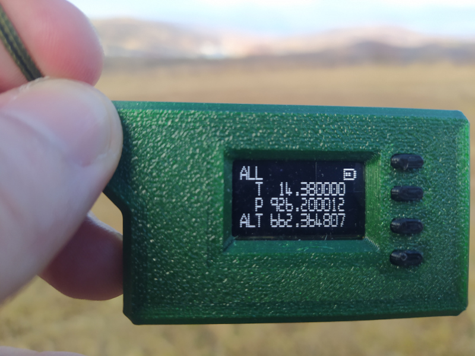
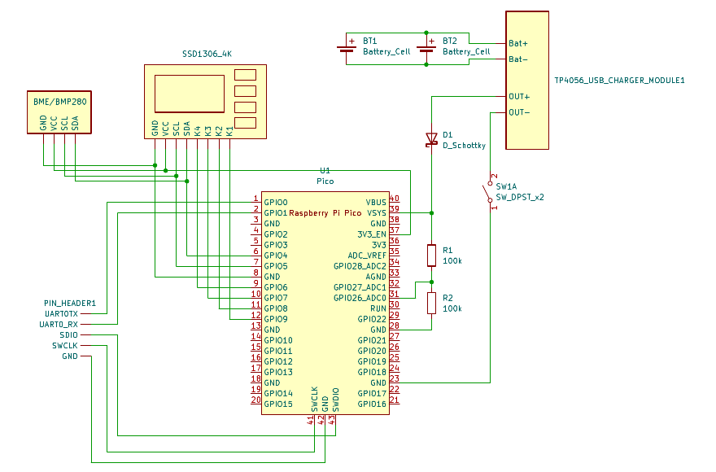
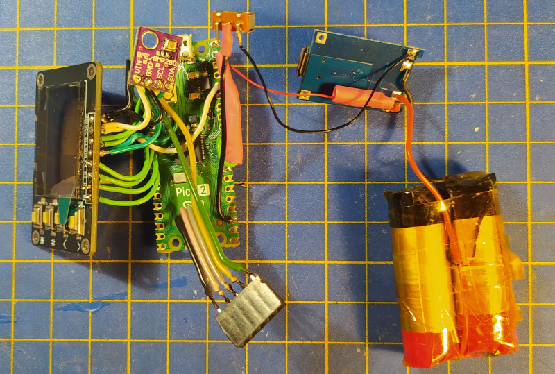
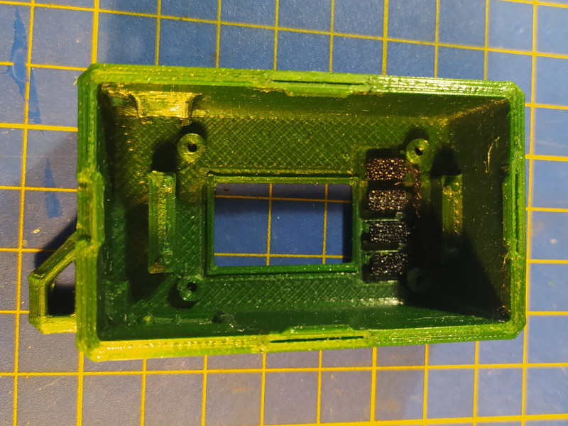
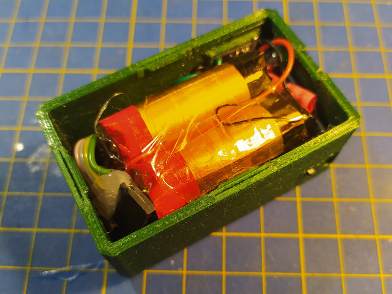
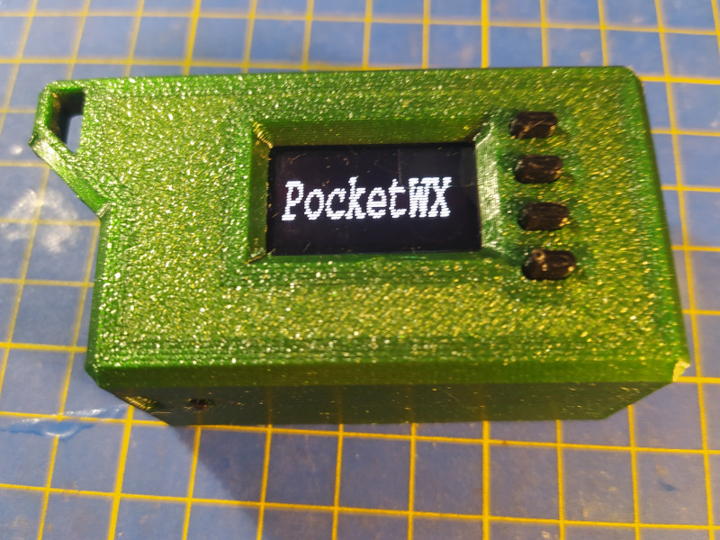

# PocketWX
Pocket Weather Station with the help of a Raspberry Pi Pico board and a BME280 sensor

# Intorduction

I enjoy hiking and wanted a compact, reliable thermometer to take on my trips. Since I couldn’t find a device that met my specifications, I built my own which can display the temperature, air pressure, and barometric altitude.

# Features

- Display Temperature
- Display Air Pressure
- Display Barometric Altitude
- Battery Level Monitoring

# Hardware

## Components
| Hardware | Description |
| ------------------ | ----------- |
| Microcontroller    | Raspberry Pi Pico 2 |
| Display            | SSD1306 display with four buttons (resolution: 128x32) |
| Sensor             | Bosch BMP/BME280 I2C module |
| Battery            | Two 3.7V 550mAh LiPo cells connected parallel |
| Battery Management | TP4056 USB Battery charger module |

## Schematic

## Wiring, the case and assembly

The components are connected with 23 AWG wires which might look a bit messy, but it gave more freedom with the 3D printed case design and assembly.

The case was designed in Autodesk Fusion360 and printed with an FDM printer using PETG filament.

After everything was in its place, the display was secured with four M2x4 screws, the BMP module, charger module and On/Off switch was bonded with some hot glue.

Finally, with a snap fit bottom plate the enclosure can be closed.

